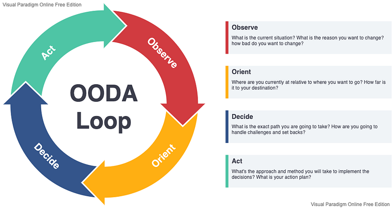

_This is part of a_ [_series_](https://petro.blog/from-engineering-to-product-manager-hello-product-9a44820875f) _following my journey into product management._

Photo by [Road Trip with Raj](https://unsplash.com/@roadtripwithraj)

This year is the second time I’ve made a significant role change. The first was moving from an engineer to an engineering manager role, which was fundamentally about switching from writing software to supporting individuals. In many ways that was a bigger change than my current lateral move into product management, but I’ll save that reflection for another post.

The specifics of these two transitions are different, but both have followed the same underlying paradigm to answer the question:

> How do you learn something new, broad, and complex?

One-off approaches to learn some new topic X or discipline Y certainly work, but the biggest gains are found in developing a repeatable way to learn. In other words, a learning system.

### My learning system

Source: [Visual Paradigm](https://online.visual-paradigm.com/knowledge/decision-analysis/what-is-ooda-loop/)

[Mental models](https://fs.blog/mental-models/) are simplified representations for how things work and can be useful to help understand complex systems and make decisions in them. The most prominent mental model in my learning system is the [OODA loop](https://fs.blog/2021/03/ooda-loop/), a four-stage cycle for information ingestion, processing, and acting originally developed in the U.S. Air Force.

#### Stage 1: Observe

Photo by [The Climate Reality Project](https://unsplash.com/@climatereality)

This stage is all about information gathering and is where I spend the most of my first 30 days. My goal for this stage is to understand what things exist, how things work, and why things are the way they are.

When I moved into new roles as a people manager and a product manager, I had to gather information on two distinct areas: the new systems I’d be operating within, and the role itself. For example: _What systems would I be shaping as a product manager? What does effective product leadership involve?_

For both information gathering areas, I started by casting a wide net:

- **I talked to as many people as possible who I’d be working with or who had first-hand experience with the role.** This included folks outside of my org and the company, too. I followed [this approach](https://boz.com/articles/career-cold-start) and set up 30-minute 1:1s with each person where I asked the same set of questions: _What should I know? What challenges do you see? Who else should I talk to?_
- **I subscribed to newsletters, joined Slack groups, and created reading lists to get a broad and diverse set of perspectives on the role.** You can find the full list of resources I used at the end of this post.

It sure felt like information overload at first, but it was necessary. Without first knowing what’s out there, it’s difficult to define better information filtering. As I learned more about the role and the systems I’d be operating within, I was able to be more selective with what I ingested and more specific with the questions I asked.

#### Stage 2: Orient

Photo by [Ryan Dam](https://unsplash.com/@ryandam)

The mountain of observations and information collected in the previous stage needs to be processed into something useful. With the context—and especially biases—of each observation in mind, I started to build my own mental models of each of the systems I needed to understand.

As a new engineering manager, this mental model creation was mostly unconscious. As a new product manager, however, I tried to be more explicit by drawing these mental models as system diagrams or by explaining them in posts like these. It’s the [Feynman Learning Technique](https://fs.blog/2021/02/feynman-learning-technique/) in action: you don’t truly understand something unless you can explain it to a stranger.

These mental models aren’t static; I continuously refine them based on new information and feedback. Feedback from individuals is a good start, but the best feedback comes from experimenting with and observing changes in the real world. Enter the final stages.

#### Stage 3 & 4: Decide & Act

Photo by [Brian Matangelo](https://unsplash.com/@bmatangelo)

The feedback and mental models I’ve developed at this point have given me a holistic understanding of the systems involved. Well, holistic enough for me to start pressure testing it by making changes in the real world.

Some people recommend only starting with small changes. Others make large, sweeping changes early in their role. The former can fail to capitalize on the fresh outside perspective you bring to the role—a perspective that’s lost if you wait too long. A common example of the latter is the new leader who immediately reorganizes the reporting and ownership structure of the team. This can be problematic too if you don’t fully understand the reasons why things are the way they are (aka [Chesterton’s Fence](https://fs.blog/2020/03/chestertons-fence/)).

Either approach applied exclusively will likely be less successful than a blended, highly contextual approach. This is what I follow:

1.  _What are the least disruptive improvements I can make that will (a) allow me to safely test my understanding and (b) start to build trust and momentum?_
2.  _What are the highest-leverage improvements that will have an outsized effect on the people, systems, and organization?_

#### Rinse & repeat

Like the name says, this OODA loop is a repeating cycle. The first iteration can take 30–90 days, but additional cycles are much faster. By the end of the first iteration, I try to have a set of processes established that enable regular information gathering, feedback, synthesis, and action. For example:

- Weekly 1:1s with individuals I work with to get feedback on what I should do and what I’ve done
- Regular surveys to everyone I’ve worked with to learn what I’m doing well, what I can improve, and any blind spots
- A regularly-reviewed [decision log](https://fs.blog/2014/02/decision-journal/) that identifies decisions that need to be or have been made, why, the approaches considered, and the outcomes
- A regular writing habit to clarify my thinking (like this post)
- A daily reading habit to continually discover new and divergent ideas

### Learning resources

#### Product

Courses:

- [Intro to Product Discovery](https://learn.producttalk.org/p/getting-started-with-continuous-discovery)

Newsletters:

- [Lenny’s Newsletter](https://www.lennyrachitsky.com/newsletter)
- [Bring The Donuts](https://newsletter.bringthedonuts.com/about)
- [Product Talk](https://www.producttalk.org/)
- [Black Box of Product Management](https://blackboxofpm.com/)

Articles:

- [Circles framework](https://productcoalition.com/how-our-cross-functional-teams-decide-what-to-build-at-whispir-e97757171e49)
- [Start Talking! How To Do Customer Interviews That Reveal Priceless Insights](https://www.crazyegg.com/blog/start-talking/)
- [Product Talk: Customer interview articles](https://www.producttalk.org/category/customer-interviews/)
- [Collection of UX research articles](https://www.notion.so/UX-Research-d6b63506440a4d468d4384a33ca200d2)

Books on vision, strategy, and organization:

- [_Build What Matters: Delivering Key Outcomes with Vision-Led Product Management_](https://www.amazon.com/Build-What-Matters-Delivering-Vision-Led-ebook/dp/B08GQMCP19) by Ben Foster
- [_Outcomes Over Output: Why customer behavior is the key metric for business success_](https://www.amazon.com/dp/B07QJ1Y8Y5/ref=dp-kindle-redirect?_encoding=UTF8&btkr=1) by Josh Seiden
- [_INSPIRED: How to Create Tech Products Customers Love_](https://www.amazon.com/dp/B077NRB36N/ref=dp-kindle-redirect?_encoding=UTF8&btkr=1) by Marty Cagan
- [_EMPOWERED: Ordinary People, Extraordinary Products_](https://www.amazon.com/dp/B08LPKRD5L/ref=dp-kindle-redirect?_encoding=UTF8&btkr=1) by Marty Cagan
- [_Escaping the Build Trap: How Effective Product Management Creates Real Value_](https://www.amazon.com/Escaping-Build-Trap-Effective-Management/dp/149197379X) by Melissa Perri
- [_Product Leadership: How Top Product Managers Launch Awesome Products and Build Successful Teams_](https://www.amazon.com/Product-Leadership-Managers-Products-Successful/dp/1491960604/ref=as_li_ss_tl?_encoding=UTF8&qid=1496245788&sr=8-1&linkCode=sl1&tag=kennor-20&linkId=0025da74613b4a733a98738d8fdb1c62) by Richard Banfield
- [_Good Strategy/Bad Strategy: The difference and why it matters_](https://www.amazon.com/dp/B005331U7Q/ref=dp-kindle-redirect?_encoding=UTF8&btkr=1) by Richard Rumelt
- [_Measure What Matters: How Google, Bono, and the Gates Foundation Rock the World with OKRs_](https://www.amazon.com/dp/B078FZ9SYB/ref=dp-kindle-redirect?_encoding=UTF8&btkr=1) by John Doerr
- [_Thinking in Bets: Making Smarter Decisions When You Don’t Have All the Facts_](https://www.amazon.com/Thinking-Bets-Making-Smarter-Decisions-ebook/dp/B074DG9LQF) by Annie Duke
- [_Team Topologies: Organizing Business and Technology Teams for Fast Flow_](https://www.amazon.com/Team-Topologies-Organizing-Business-Technology-ebook/dp/B07NSF94PC/ref=sr_1_1) by Matthew Skelton

Books on customer research:

- [_The Mom Test: How to talk to customers & learn if your business is a good idea when everyone is lying to you_](https://www.amazon.com/Mom-Test-customers-business-everyone/dp/1492180742) by Rob Fitzpatrick
- [_Why You Are Asking the Wrong Customer Interview Questions_](https://www.producttalk.org/2016/03/customer-interview-questions/) by Teresa Torres

#### Engineering

Newsletters:

- [Software Lead Weekly](https://softwareleadweekly.com/)
- [Pointer.io](https://www.pointer.io/)
- [Irrational Exuberance](https://lethain.com/)
- [The Pragmatic Engineer](https://blog.pragmaticengineer.com/)

Books:

- [_An Elegant Puzzle_](https://lethain.com/elegant-puzzle/) by Will Larson

#### People leadership

Books:

- [_Drive_](https://www.danpink.com/books/drive/) by Daniel Pink

Blogs:

- [Rands in Repose](https://randsinrepose.com/) (there’s a Slack group as well)

#### General problem solving and systems thinking

Courses:

- [Decision by Design](https://fscourses.com/p/decision-by-design-sign-up-now)

Newsletters:

- [Farnam Street](https://fs.blog/) (clearly one of my favorites, if you can’t tell by the number of links in this post)

Books:

- [_Thinking, Fast and Slow_](https://www.amazon.com/dp/B005MJFA2W/ref=dp-kindle-redirect?_encoding=UTF8&btkr=1) by Daniel Kahneman
- [_The Fifth Discipline: The Art & Practice of The Learning Organization_](https://www.amazon.com/dp/B000SEIFKK/ref=dp-kindle-redirect?_encoding=UTF8&btkr=1) by Peter Senge
- [_The Fifth Discipline Fieldbook: Strategies for Building a Learning Organization_](https://www.amazon.com/dp/B01HPVHMPM/ref=dp-kindle-redirect?_encoding=UTF8&btkr=1) by Art Kleiner
- [_The Great Mental Models: Volume 1_](https://www.amazon.com/Great-Mental-Models-Thinking-Concepts-ebook/dp/B07P79P8ST) by Shane Parrish
- [_Out of the Crisis_](https://www.amazon.com/Out-Crisis-Press-Edwards-Deming/dp/0262541157) by W. Edwards Deming
- [_Thinking in Systems_](https://www.amazon.com/dp/B005VSRFEA/ref=dp-kindle-redirect?_encoding=UTF8&btkr=1) by Donella H. Meadows

#### **Psychology**

- [_Switch: How to Change Things When Change Is Hard_](https://www.amazon.com/dp/B0030DHPGQ/ref=dp-kindle-redirect?_encoding=UTF8&btkr=1) by Chip Heath
- [_Made to Stick: Why Some Ideas Survive and Others Die_](https://www.amazon.com/dp/B000N2HCKQ/ref=dp-kindle-redirect?_encoding=UTF8&btkr=1) by Chip Heath
- [_Influence: The Psychology of Persuasion_](https://www.amazon.com/Influence-Psychology-Persuasion-Robert-Cialdini/dp/006124189X/ref=nodl_) by Robert Cialdini
- [_Atomic Habits: An Easy & Proven Way to Build Good Habits & Break Bad Ones_](https://www.amazon.com/Atomic-Habits-Proven-Build-Break-ebook/dp/B07D23CFGR/ref=sr_1_1?dchild=1&keywords=atomic+habits&qid=1615929200&s=digital-text&sr=1-1) by James Clear

#### **Design**

- [_Lean UX: Designing Great Products with Agile Teams_](https://www.amazon.com/gp/aw/d/1491953608/ref=cm_cr_arp_mb_bdcrb_top?ie=UTF8) by Jeff Gothelf
- [_Articulating Design Decisions: Communicate with Stakeholders, Keep Your Sanity, and Deliver the Best User Experience_](https://www.amazon.com/gp/aw/d/1492079227/ref=cm_cr_arp_mb_bdcrb_top?ie=UTF8) by Tom Greever

#### **Other**

- [_Sapiens: A Brief History of Humankind_](https://www.amazon.com/dp/B00K7ED54M/ref=dp-kindle-redirect?_encoding=UTF8&btkr=1) by Yuval Noah Harari
- [_The Inevitable: Understanding the 12 Technological Forces That Will Shape Our Future_](https://www.amazon.com/Inevitable-Understanding-Technological-Forces-Future/dp/0525428089/ref=as_li_ss_tl?ie=UTF8&qid=1475163452&sr=8-1&keywords=kevin+kelly&linkCode=sl1&tag=kennor-20&linkId=f304fa00ae32e90ec6ada227946d1df1) by Kevin Kelly
- [_Deep Work_](https://www.amazon.com/Deep-Work-Focused-Success-Distracted-ebook/dp/B00X47ZVXM/ref=tmm_kin_swatch_0?_encoding=UTF8&qid=&sr=) by Cal Newport
- [_Death by Meeting_](https://www.tablegroup.com/product/dbm/) by Patrick Lencioni
