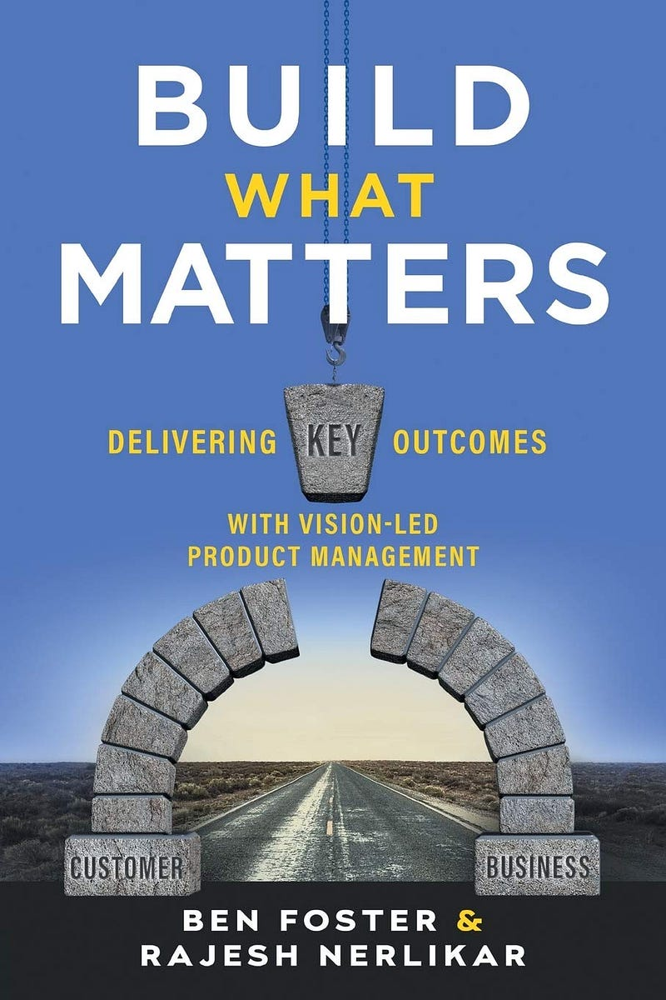
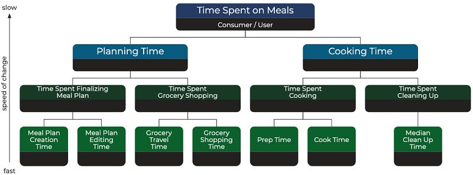
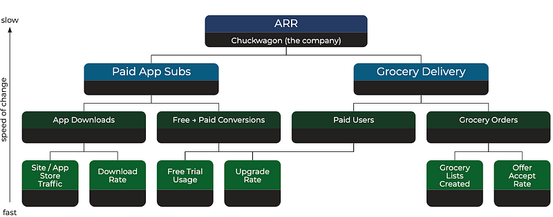

_I’ve started a practice of reading one book every week. To help me actually remember what I read, I’m following the_ [_Feynman technique_](https://fs.blog/2021/02/feynman-learning-technique/) _by writing a synthesis of what I’ve learned from each book._

This week, I finished reading [Build What Matters](https://www.amazon.com/Build-What-Matters-Delivering-Vision-Led-ebook/dp/B08GQMCP19) by Ben Foster.

### TL;DR

Follow these steps to avoid common product organization dysfunctions and enable the delivery of significant customer and business value.

1.  Define customer and business outcome pyramids to identify KPIs.
2.  Create a customer journey vision that would 10x the customer and business outcomes, using visual artifacts like a comic strip and mock-ups.
3.  Work backwards from that vision to define a strategy and milestones to achieve it.
4.  Decide on how to organize product ownership: by product, by feature, by tech layer, by customer segment, by customer journey stage, or by performance metric.
5.  Proactively decide on the level of investment in innovation vs. iteration vs. operation work based on each product’s lifecycle stage.
6.  Communicate directly with customers and collaborate closely with teams to keep a tight execution-feedback loop.
7.  Hire the most diverse team possible — across race, gender, expertise, and experience.

### The mission of product management

Product management’s mission is not solely to extract value from today’s customers. It’s to deliver customer value at levels never before thought possible.

> Product management’s mission is to deliver customer value at levels never before thought possible.

### Common dysfunctions

What impedes product management on this mission? Frequent dysfunctions of a product organization are:

1.  **Counting House:** Internal metrics are more important than delivering customer value.
2.  **Science Lab:** Incremental A/B testing is overused at the cost of real innovation.
3.  **Business School:** Decisions are predominantly driven by unvalidated ROI analyses instead of a product strategy.
4.  **Throne Room:** The CEO/CPO doesn’t delegate decisions and frequently changes prioritizes on a whim.
5.  **Roller Coaster:** The business constantly changes priorities because they’re impatient to see results, but seeing results takes learning and iteration.
6.  **Bridge To Nowhere:** Engineering prematurely builds or over-builds systems.
7.  **Hamster Wheel:** The organization measures output over outcome.
8.  **Feature Factory:** One feature is built after another, often at the expense of entire market opportunities. “_This_ will be the feature that changes everything,” they say.
9.  **Ivory Tower:** The product team doesn’t talk to customers because they think they know customers better than customers know themselves.
10. **Negotiating Table:** Product tries to maximize stakeholder happiness by reactively saying yes as much as possible instead of driving a holistic product vision.

The antidote to these dysfunctions is strong product leadership with a vision.

### How to achieve a product vision

1.  **Define the key customer outcome.** If the customer is able to achieve this, business success will follow. (No, MAUs is not a customer outcome)
2.  **Define the customer journey vision.** How would a customer discover, use, and achieve their key outcome with the product?
3.  **Define the product strategy.** How do you go from today’s customer journey to the one envisioned?

### Outcome pyramids

Starting with the key customer outcome, identify the supporting outcomes that lead to it, and then the supporting outcomes that lead to those, and so on. This dependency tree can be arranged into a pyramid with the key customer outcome at the top.

For example, imagine a business whose mission is to help users prepare and serve home-cooked meals. Their customer outcome pyramid could be:

Source: [Prodify](https://www.prodify.group/blog/strategic-planning-case-study-chuckwagon)

In addition, the business has a key outcome tied to the customer outcome. After all, it probably needs to make money. A separate business outcome pyramid can be created to capture important business measures:

Source: [Prodify](https://www.prodify.group/blog/strategic-planning-case-study-chuckwagon)

### Elements of a good product vision

1.  Bold; it should try to 10x the key customer outcome
2.  Time-bound, eg. for the next 3–5 years
3.  Includes each stage of the customer journey
4.  Has competitive differentiators
5.  Written down
6.  Communicated clearly, best in the form of a comic strip or customer diary with visual mockups

### Stages of the customer journey

1.  **Trigger:** How do customers realize they have a problem (that the product can solve)?
2.  **Discovery:** How do customers discover that the product can solve that problem?
3.  **Evaluation:** Do customers want to try out the product?
4.  **Trial:** Customers try the product and decide if they want to continue with it.
5.  **Engagement:** How deeply do customers use the product and all of its features?
6.  **Retention:** Are customers getting the value they expected from the product? Are they aware of that?

### Feature categories to focus on

These are derived from the [Kano model](https://foldingburritos.com/kano-model/).

1.  **Must-haves:** Potential customers won’t consider the product without these features. Customer satisfaction doesn’t scale much with these.
2.  **Performance:** What features do customers use to evaluate and compare the product? The product should do ALL of these features better than competitors for at least one customer segment. Customer satisfaction scales linearly with these.
3.  **Delighters:** Unexpected bonus features that customers will talk about the most. Customer satisfaction scales exponentially with these. They’re important even for an MVP.

### How to choose between product ownership organization models

Seams between ownership areas will always exist due to [Conway’s Law](https://en.wikipedia.org/wiki/Conway%27s_law). Find the organizational structure that minimizes the negative business impacts of them based on what you’re optimizing for:

- Maximizing team autonomy
- Minimizing seams in customer UX
- Clarity of product ownership
- Product lifecycle stage

Possible ways to organize:

- **By product:** Clear ownership but not customer focused. Product vision/strategy is constrained to specific products. Requires coordination if products have dependencies. Good for companies with few dependencies between products.
- **By feature:** Clear ownership, fewer dependencies than other options — except when larger infrastructure/architecture changes are needed. Product vision/strategy is constrained to specific features. Best for companies with mature, meaty features.
- **By technical layer:** Clear technical area ownership, but can lead to inconsistent UX between platforms. Can lead to dependency hell where no single team can ship anything on their own. Appropriate for highly technical or algorithmic companies.
- **By customer segment or persona:** Focuses on needs of users but requires heavy coordination to avoid duplication of effort and to stay aligned on strategy and standards. Easier for individual teams to become experts of a particular customer segment. Appropriate for companies with very different customer segments.
- **By customer journey stage:** Facilitates delegation of business outcomes/metrics at each stage, but requires heavy collaboration to ensure consistency of UX across the journey, esp. for cross-stage viral loops. Appropriate for companies with stable linear customer journeys with a heavy emphasis on growth.
- **By performance metric:** Facilitates delegation of those metrics, but product/feature ownership becomes muddled, esp. when multiple teams need to collaborate on the same products/features. Appropriate for companies with stable KPIs that capture customer and business outcomes.

### How to balance product priorities

Trying to prioritize innovative, exploratory work vs. iterative feature development vs. operational support and bug fixes can feel like comparing apples to oranges to bananas. Instead of reactively prioritizing these types of work that arrive, proactively establish percentages for how much time should be spent in each area for each product: innovation, iteration, or operation.

These percentages will depend on the stage of each product:

- _Pre launch:_ **High innovation** / Low iteration / Low operation
- _Post launch:_ Low innovation / **High iteration** / Low operation
- _Product market fit:_ Low innovation / **High iteration** / Low operation
- _Scaling:_ Low innovation / Low iteration / **High operation**
- _Steady:_ **High innovation** / Low iteration / Low operation

Prioritization heuristics can be different within each category of work:

- _Innovation:_ What moves towards strategy & vision?
- _Iteration:_ Informed by RICE scores
- _Operation:_ SLAs, bug quotas, quality thresholds
