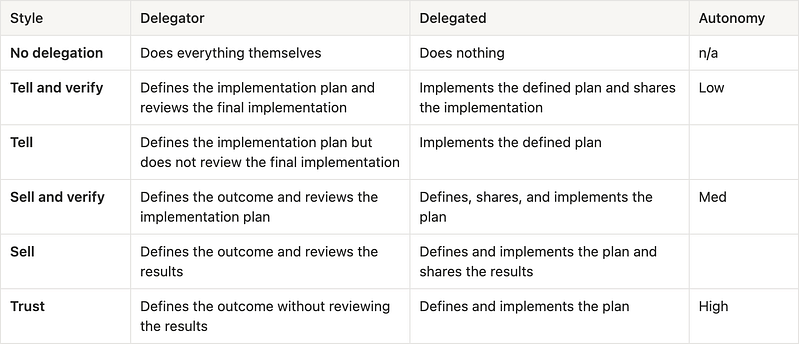

### What is delegation?

Simply put, it’s the act of transferring full or partial ownership of a task to someone else, ideally to maximize the collective impact and growth opportunities of everyone involved. When done well, this can create space for delegators to focus on their highest-leverage activities and give delegated individuals opportunities to work on things that help them grow. When done poorly, it can create resentment, frustration, and waste for everyone.

#### Delegation levels

There are many ways to define delegation styles, but I’ve found the levels below to be the most practical.

### Common delegation problems

Delegating well is difficult, and most people aren’t amazing at it (myself included). The most common problem I’ve observed is that delegators don’t use the delegation style that’s appropriate for the task and the delegated individual’s skill at that task. This manifests itself in one of two ways:

- **Insufficient autonomy:** The delegator doesn’t give the delegated individual enough autonomy in completing the task. At one extreme, the delegator doesn’t even delegate the task — they do it themselves. At the other extreme, they micromanage every detail unnecessarily. This can be incredibly frustrating and demotivating for the delegated and a poor use of time by the delegator.
- **Too much autonomy:** The delegator gives the delegated more responsibility than they can effectively handle, and the delegated struggles to deliver. This typically happens when delegated individuals lack experience with the skill required by the task, and what’s asked of them is too far out of their comfort zone and area of competence.

### How to fix a delegation problem

Once you’ve identified that you have delegation problem based on the signals above, follow these steps:

1.  Identify which delegation level you’re using for the task.
2.  Diagnose which of the two situations you’re in — too little or too much autonomy — and adjust your delegation level up or down accordingly.

Finally, remember that delegation levels are task-dependent: the same person may be operating at one delegation level for a task but at a completely different level for another task.
