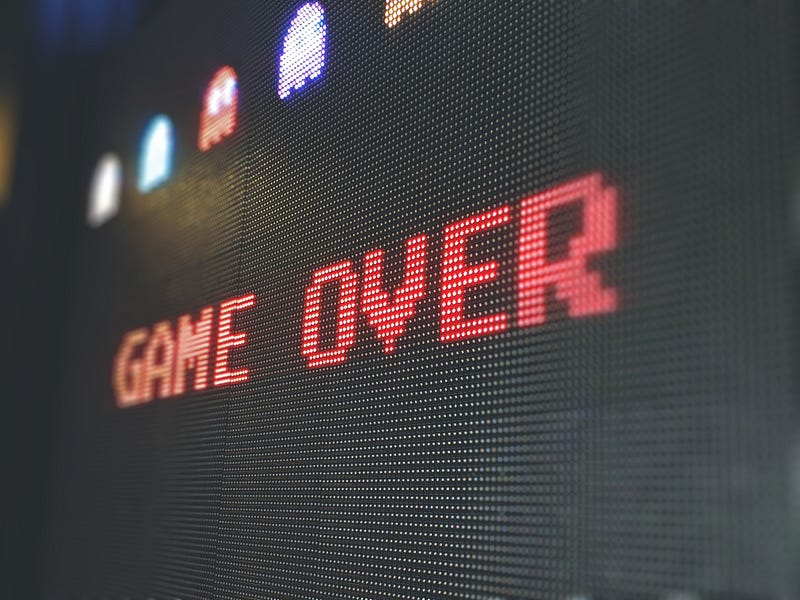

The Titanic and its passengers were victims of poor decision-making (i [Strings Magazine](https://stringsmagazine.com/the-spirit-of-the-rms-titanic-and-the-band-played-on/))

We all make decisions. Constantly. Whether to snooze the alarm, what to have for lunch, or what to watch tonight. Most are inconsequential like these, but others have a larger, unknowable impact on our future. Whether to apply for that job, strike up conversation with that stranger, or book that trip on the Titanic.

Despite its ubiquity, decision-making is a skill. Like many skills, it can benefit from the same principles behind [deliberate practice](https://fs.blog/deliberate-practice-guide/). That’s a technique for taking an activity and breaking it down into parts that can be measured, practiced, and improved in a feedback loop.

So how do you apply this to decision-making?

#### **First, separate the decision from the decision-making process**

Don’t judge the quality of your decision-making based on the outcome of an individual decision. Sometimes the worst outcome happens in spite of a good process, and other times you get lucky in spite of a bad one. It’s probabilistic, not deterministic. Good decision-making just increases the probability of success.

#### **Second, realize that success is more often about avoiding mistakes than it is about being gifted**

Sports is a great example. At all but the highest levels, winning is mostly about avoiding unforced errors than it is about playing brilliantly. Like sports, most of the improvement in decision-making comes from minimizing the risk of failure and [regret](https://alyjuma.medium.com/the-regret-minimization-framework-how-jeff-bezos-made-decisions-4d5a86deaf24).

#### **Third, the goal is to maximize your rate of learning**

The most successful individuals and organizations are the ones who learn the fastest about what makes them successful—and what doesn’t. But you can’t learn without trying and failing. A lot.

### A decision-making framework

Based on these principles, [dedicated training](https://fscourses.com/p/decision-by-design-sign-up-now), and years of deliberate practice, I try to follow this structure for all my consequential decisions:

1.  Define the problem
2.  Identify the reversibility of the decision
3.  Select the participants
4.  Define the evaluation criteria
5.  Ideate and evaluate the options
6.  Premortem the best options
7.  Make a decision
8.  Later, retrospect

Photo by [Steve Johnson](https://unsplash.com/de/@steve_j?utm_source=medium&utm_medium=referral) on [Unsplash](https://unsplash.com?utm_source=medium&utm_medium=referral)

### **1\. Define the problem**

This is both the most important and most often overlooked step in making a decision:

> What problem are you trying to solve?

To paraphrase a [passage from _Alice in Wonderland_](https://philosiblog.com/2011/07/13/if-you-dont-know-where-youre-going/): If you don’t know what the problem is, then any solution will do.

Many problems are really just symptoms of a deeper problem. Addressing the symptom instead of an underlying cause will probably not solve the problem in the long-term, if at all. One of the qualities of a good decision is its longevity, i.e. how long it lasts before being revisited.

When defining the problem, resist the urge to accept the stated problem at face value, and confirm for yourself whether it’s (a) actually a problem and (b) the right problem to solve instead of a deeper one.

If you follow this rabbit hole of deeper causes to its logical conclusion, you might discover that the ultimate root cause is *change—*in the system or its environment. However, most decisions and decision-makers have a limited scope, so it’s up to you to decide how deep you want to go.

Finally, how will you know if you’ve actually solved the problem? What would be true? Can it be measured? An essential part of defining the problem is to describe what the world looks like when the problem no longer exists.

Photo by [Aron Visuals](https://unsplash.com/@aronvisuals?utm_source=medium&utm_medium=referral) on [Unsplash](https://unsplash.com?utm_source=medium&utm_medium=referral)

### **2\. Identify the reversibility of the decision**

Every decision has an opportunity cost. What are the tradeoffs if you decide one way vs. another vs. not making a decision at all?

One of the biggest opportunity costs is _learning_. You can’t learn what works and what doesn’t until you try, and you can’t try without first making a decision about _what_ to try.

The speed of your decision-making has a direct impact on how soon you’ll be successful. The slower you are at making decisions, the fewer decisions you’ll make, and the less you’ll learn over time. For many organizations, a slow rate of learning can be fatal. But making a rushed decision can be dangerous too, particularly if the cost of making a wrong decision is high.

For many decisions, the speed-vs-quality tradeoff is obvious, and we choose the appropriate one intuitively. You’d certainly spend more effort deciding on your next home vs. what to have for lunch. But for many decisions—especially those in the workplace—it’s more ambiguous. How do you know when to decide quickly vs. carefully?

One answer is to classify decisions based on their reversibility:

> How costly or difficult would it be to change the decision if it ends up being the wrong one?

#### **Mostly reversible decisions: Decide as soon as possible**

Mostly reversible decisions are like walking through a door: if you don’t like what you see, you can go back. For example, deciding between different products on Amazon is easily reversible due to flexible return policies and free, fast shipping.

For these decisions, decide as soon as possible since the cost of making the wrong decision is probably lower than the cost of indecision.

#### **Mostly irreversible decisions: Decide as late as possible**

Mostly irreversible decisions are expensive or impossible to undo. For example, deciding to move to another city is mostly irreversible due to the high cost of switching homes/schools/jobs and the fact that it may not be possible to return to the same ones if you change your mind. Some decisions are completely irreversible, such as whether to be a parent. These are one-way doors.

For these decisions, decide as late as possible since the cost of making the wrong decision is higher than the cost of indecision. Meanwhile, try to lower the risk of making a wrong decision by collecting more information that will help you make a decision. Keep collecting information until (a) you stop collecting useful information or (b) the cost of indecision becomes greater due to missed opportunities and other risks.

Collecting information is more than just research. One of the best ways to collect information is to run experiments. Is there a lower-risk way to test the different options you’re considering? Large decisions can often be broken down into smaller, more easily tested ones.

Photo by [Pawel Chu](https://unsplash.com/@pawell?utm_source=medium&utm_medium=referral) on [Unsplash](https://unsplash.com?utm_source=medium&utm_medium=referral)

### **3\. Select the participants**

Who should be involved in the decision? An alphabet soup of popular models exist for identifying participants and their roles: [DACI](https://www.atlassian.com/team-playbook/plays/daci), [RACI](https://www.fastcompany.com/90697052/if-your-company-is-growing-fast-try-the-raci-method-to-expedite-decision-making), [DARE](https://www.mckinsey.com/capabilities/people-and-organizational-performance/our-insights/the-organization-blog/the-limits-of-raci-and-a-better-way-to-make-decisions), [RAPID](https://www.bridgespan.org/insights/library/organizational-effectiveness/rapid-decision-making#:~:text=RAPID%20is%20an%20acronym%E2%80%94an,which%20things%20should%20be%20done.). These models are largely the same and differ mostly in how they draw the lines between the different areas of decision-making activity.

Regardless of the approach, you’ll need to be able to answer the following questions:

- **Who’s making sure a decision gets made?**
- **Who should be consulted before making a decision?** What’s the heuristic for identifying who to include? Primary sources are better than secondary ones.
- **Does anyone need to formally approve the decision?** If so, they should be consulted early in the process to understand their needs and incentives.
- **Who should be informed of the final decision?**
- **Who will implement or execute the decision?**
- **Do the selected participants represent a _diverse_ set experiences and perspectives?**

The last point is particularly subtle and rarely considered, but it has a large effect on the robustness of the decision. A group of people who think alike are likely to, well, think alike and generate a smaller set of similar ideas. Compare this to a group of people with wildly different ways of thinking who are more likely to generate a broad set of divergent ideas. Like we see in nature, solutions born from diverse pools of possibilities are more resilient than those coming from small puddles of homogeneity.

> In short, the creativity and resilience of a solution is strongly affected by the diversity of its inputs.

Finally, on a more administrative note: remember to write things down. Not only should the individuals here be identified, but also _documented_. If it’s not written down, it’s at risk of being forgotten. Nothing sinks a decision faster than forgetting to include key stakeholders or misremembering what problem you’ve agreed to solve.

Photo by [Glenn Carstens-Peters](https://unsplash.com/@glenncarstenspeters?utm_source=medium&utm_medium=referral) on [Unsplash](https://unsplash.com?utm_source=medium&utm_medium=referral)

### **4\. Define the evaluation criteria**

How will the success of the decision be evaluated? Without explicit, measurable criteria, it will be difficult to confidently say whether the decision actually solved the original problem. Confirmation bias and the [highest paid person’s opinion](https://jeffgothelf.com/blog/highest-paid-persons-opinion/) often then takes hold in these cases.

In addition, decisions often fail because of unvoiced differences in what each of the participants are optimizing for. How likely are participants to align on a decision if they disagree on what the most important factors are? Making these factors explicit and resolving their differences is a critical step in reaching a decision that everyone can move forward with.

This is why it’s vital that evaluation criteria are defined _before_ making a decision. To help identify criteria, consider the following questions:

- **What factors are important in selecting a viable option?** Discriminating factors are more useful than ones that all options will satisfy.
- **What is the relative importance of these factors?** What’s the most important one?
- **What constraints exist?** eg. _Cost cannot exceed $X_

For example, say you’re looking for a new home. Your evaluation criteria might be:

1.  **Distance to work and school:** No more than 20 minutes by car
2.  **Cost:** No more than $X/month
3.  **Size:** Minimum 2 bedrooms
4.  **Amount of light:** To what degree does sunlight illuminate the interior?
5.  **Proximity to a park/green space:** Is it in walking distance?
6.  **Quality of interior:** wood vs. tile vs. carpet, quality of appliances and fixtures

Defining these criteria and their relative important up front can help you avoid getting seduced by a home that seems great but ends up not actually being what you want—aka buyer’s remorse.

You might also discover that you and your partner’s lists of criteria are pretty different. I can tell you from personal experience that it’s far easier to discuss and resolve those differences _before_ you commit to a home then after.

Photo by [Victoriano Izquierdo](https://unsplash.com/@victoriano?utm_source=medium&utm_medium=referral) on [Unsplash](https://unsplash.com?utm_source=medium&utm_medium=referral)

### **5\. Ideate and evaluate the options**

What are all possible options to solving the problem? Time to brainstorm! The goal here is quantity, not quality, so go wide and include options even if they may not be viable.

Try these strategies to discover additional options you might not have otherwise considered:

- **Eliminate options.** If one or more of the most promising options weren’t available, what would you do? These constraints can help you think of more creative solutions.
- **Combine options.** Can parts or the whole of different options be combined in novel ways?
- **Look at opportunity costs.** By pursuing a particular option, you’re forgoing other opportunities. What are they? What if you pursued those instead?

Once you’ve identified a whole menu of possible options, now it’s time to evaluate each of them according to your evaluation criteria. It should be easy if you’ve defined the criteria as measurable things.

Photo by [Sigmund](https://unsplash.com/@sigmund?utm_source=medium&utm_medium=referral) on [Unsplash](https://unsplash.com?utm_source=medium&utm_medium=referral)

### 6\. Premortem the best options

By now you should have at least one viable option for consideration. Imagine that you selected it, but it failed to solve the original problem. Why? What happened?

If success is indeed mostly about avoiding failure than it is about being brilliant, then:

> We can ensure a higher probability of success by identifying and mitigating the ways in which we might fail.

In contrast with a postmortem, which attempts to diagnose the causes of failure _after_ the fact, a premortem is a thought exercise that attempts to identify potential sources of failure _before_ they happen.

To do a premortem, start at the end — you’ve failed — and work backwards. What are the things that failed, and what were the steps that led to them?

Continuing the previous home-hunting example, imagine you selected a particular home to move into and quickly discovered that you hate it. Why? The neighborhood sucks. Nothing is in walking distance, and even if you drive to the nearest cafes, bars, and restaurants, they’re all mediocre.

But don’t stop there. Why didn’t you discover earlier that the neighborhood sucks? Perhaps you didn’t realize the importance of walkability, nor did you realize how disappointing the surrounding establishments are. As you continue asking _why_ and working backwards, you may discover important criteria like these that you hadn’t considered.

Mitigations to these sources of failures will become clearer as you work backwards. For instance, perhaps you can spend a few days actually living in the prospective neighborhood (via Airbnb or a hotel) to see how it really feels to be there. Be creative! Remember, time/effort/money spent reducing risk now will often be more cost effective than fixing the problems caused later. As famed architect Frank Lloyd Wright once said, “You can use an eraser on the drafting table or a sledge hammer at the construction site.”

Photo by [Angelo Pantazis](https://unsplash.com/@angelopantazis?utm_source=medium&utm_medium=referral) on [Unsplash](https://unsplash.com?utm_source=medium&utm_medium=referral)

### **7\. Make a decision**

Ironically, this is the easiest part once you’ve done the work of the previous steps. During the evaluation phase, a picture of the optimal solution likely emerged: one that addressed the most important criteria better than the others. If a clear winner wasn’t evident, it should have at least made it clear what the main tradeoffs are between the top contenders.

In either case, it’s time to make a decision. Whatever ownership model you’re using (DACI, RAPID, etc.), someone needs to select the appropriate option and get a commitment from the others needed to move forward with it. Others can disagree with the decision but should still commit to trying it. Committing and moving forward is more important than consensus, because after all, any particular decision is still a hypothesis that might be proven wrong. But its success or failure will be unknown until a decision is made and implemented.

Photo by [Nathan Maduta](https://unsplash.com/@nathantm12?utm_source=medium&utm_medium=referral) on [Unsplash](https://unsplash.com?utm_source=medium&utm_medium=referral)

### **8\. Later, retrospect**

So you’ve made a decision. Champagne! Are we done? Not yet. In addition to the work to actually implement the decision, the most important step remains: to learn from it.

It’s tempting to move onto the next decision right away. However, recall that the goal of this whole process is to maximize your ability to learn what will make you successful. And:

> Learning cannot happen without reflection.

Once the decision has had time to take hold—which can take weeks or months—reflect back on both the outcome of the decision and the way in which it was made. Particularly:

- Did the decision actually solve the original problem? If not, why?
- How could we have made this decision more thoughtfully or efficiently?
- What can we learn from it and apply to future decisions?

I’ve found it helpful to schedule the retrospective in advance so it’s not forgotten.

And that’s it! We’re finally done.

**⌘**
