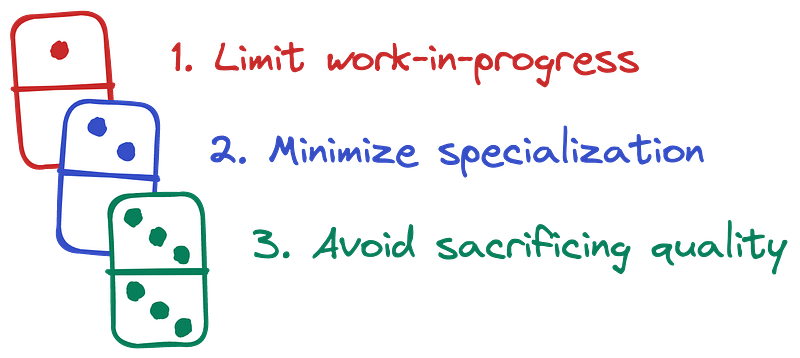

Photo by [Tom Wilson](https://unsplash.com/@pastorthomasbwilson)

**Every team is a system** containing inputs, outputs, processes, constraints, and incentives. Like any system, everything is connected, and often in subtle ways. Change one behavior over here, and a seemingly unrelated behavior over there changes, too. Second, third, and Nth-order effects abound.

I’ve worked in, managed, and observed software engineering teams across a variety of conditions. Not an especially large number, but enough to see common patterns emerge. I’ve distilled these patterns into a set of three simple rules that appear to trigger a domino effect of downstream behaviors. When followed, it seems easier for a team to operate well. When ignored, problems are more likely.

### The 3 dominoes

### 1\. Limit work-in-progress

_How may independent bodies of work have been started but not yet finished?_

When fewer things are in progress, it enables more people to work together on the same things. When more people work together on a problem, more diverse perspectives go into the solution. This creates a more robust solution. More people collaborating on a problem also leads to increased knowledge sharing, less context switching, and fewer delays due to illness, vacation, attrition, on-call, or contributors being pulled off to work on something else. And in software development, it results in more people who understand and can support the software.

> Limiting work-in-progress gives the team enough slack to adapt to unknowable future changes.

What happens when this rule is ignored? I’ve witnessed similar effects every time. When each individual is working on a completely different problem, it’s harder to meaningfully review each other’s work. Quality across these workstreams becomes inconsistent. One day, a team member becomes unavailable for a prolonged period (or they leave). The rest of the team has to scramble to understand the problem and their work. On another day, an urgent new priority is handed to the team. One of the existing in-flight projects must be sacrificed and put on hold. The longer it stays unfinished, the longer it’s likely to remain so.

Limiting work-in-progress gives the team enough slack to adapt to unknowable future changes. It’s supported by queueing theory, which states that as the usage of a system approaches 100%, delays increase exponentially. These effects [can be clearly modeled](https://lethain.com/limiting-wip/).

Of course there are limitations. Not all things can be worked on by multiple people simultaneously, and at some point there are diminishing returns as you add more contributors to a project. But doing fewer things with more contributors is a better default than the inverse.

### 2\. Minimize specialization

_How many tasks can only be done by a few people on the team?_

It’s common to see specialization at a high level between design, product, engineering, science, sales, marketing, and finance. At this level, specialization is probably necessary because of how hard it is for an individual to be a effective across many of these disciplines simultaneously. However, problems are more likely when specialization gets more granular than that.

> Specialization creates handoffs, and handoffs lead to more work-in-progress.

It’s easy to see the handoffs that occur between high-level specializations. Engineers wait for designers to hand off UI designs, designers wait for product managers to hand off product requirements, and so on.

Less obvious are the handoffs that occur between more granular specializations like UX vs. UI designers or UI vs. API vs. data vs. system engineers. UI engineers wait for API engineers to hand off a working API, API engineers wait for data engineers to hand off a datastore with the data needed, and data engineers wait for system engineers to provision the datastore. It’s turtles all the way down.

What do you think each of these engineers is doing while they wait? Watching cat videos? [Sword fighting](https://xkcd.com/303/)? Nope. They’re probably each working on something completely different, which now increases the team’s amount of work in progress. Whoops.

Now imagine if there was no sub-specialization and every engineer could provision datastores, ingest and process data, develop APIs, and create UIs. They could work together on each step of that dependency chain, generating more collaborative solutions faster than when alone. Nobody is waiting idly, and work-in-progress is minimized.

“But the UI/API/data/system engineers don’t know or want to learn how to do system/data/API/UI engineering,” you say. As a manager, you have a choice to make: Do you want to optimize for the long-term success of the team or to optimize for avoiding the short-term pain of getting individuals out of their comfort zones? Expanding your comfort zone by continually learning new skills is necessary to gain a [T-shaped skillset](https://en.m.wikipedia.org/wiki/T-shaped_skills).

> Do you want to optimize for the long-term success of the team or optimize for avoiding the short-term pain of getting individuals out of their comfort zones?

If your team has granular specializations like these, changing them will be difficult at first. You’ll probably encounter resistance from nearly everyone, and your team will feel less productive and more frustrated in the first few months. Be patient. When learning anything new, it takes time to get over the initial hump of imposter syndrome and feelings of failure. But if you start small with simple tasks with lots of pairing and coaching, those small wins will grow and confidence in those new abilities will follow. A virtuous feedback loop will be created.

However, there are limits to what’s possible here, too. Your organization may have constraints on who can provision datastores, or the specializations may be so niche and hard to learn that it’s just not practical to avoid them. But don’t fall into the trap of avoiding short-term growth pains at the expense of better long-term success.

### 3\. Avoid sacrificing quality

_Does the team cut corners in order to hit a target?_

You may be familiar with this classic triple-constraint:

> Time, scope, or resources: Pick two to constrain; the other should be left unconstrained.

It’s a useful model for choosing what to optimize for. However, there’s an implicit fourth dimension that can be unintentionally affected: quality. Specifically, quality of both _what_ a team produces and _how_ they produce it.

#### An all-too-common story

Let’s imagine a team has to deliver an important piece of software in time to reveal it at a popular conference. Given this deadline and their fixed headcount, the team decides to constrain time and resources but leave scope unconstrained. That is, they’ll adjust the feature set to fit within the fixed timeframe and capacity of the team. So far, so good.

Partway through development, however, the engineering manager shares some bad news with the product manager. “We won’t be able to include feature X in the initial release after all,” laments the engineering manager. “Some of the features have proven more difficult to develop and test than originally planned, so we have to cut scope.”

“Oh no, are you sure?” the product manager responds. “The CEO was going to spend a lot of time highlighting feature X in the conference keynote presentation. They’ll be pissed.”

“Is there anything else less important that we can cut?” asks the engineering manager. “No,” the product manager replies, “everything else is critical. We can’t ship without the rest.”

You can replace “conference” with “marketing push”, “huge client deadline”, or any number of deadline motivations — the mechanics are the same. This situation is so common it could be a bedtime story. But it would probably give the parent nightmares.

At this point in our story, the team can take two possible paths. Let’s see which one you’d choose.

#### The easy path

In the first path, the team changes the only other dimension that it can: quality. They agree to lower the quality of their process and work by reducing the degree of testing that’s been slowing them down. “It’s fine,” the engineering manager says, “This is temporary, and after the release we’ll revisit this and improve our testing.” You might be able to predict what happens next.

With the quality seal broken, the team feels more comfortable lowering quality elsewhere when it gets in the way. Code and architecture reviews are less thorough and “LGTM” (Looks Good To Me) are frequently the only feedback. When there is feedback, “We’ll fix it after the release” becomes the refrain. What was previously a disciplined, quality-first process has unintentionally slipped into a ship-first-ask-questions-later Wild West. I may be dramatizing for effect, but not by much.

“But it really is only a _temporary_ reduction in quality,” you retort. “Surely a team has the discipline to responsibly and temporarily lower quality once in a while in order to hit a key target.” My answer: Few teams do, and rarely. Why? It’s psychological.

> When quality is sacrificed once, it’s more likely to be sacrificed again.

Enforcing quality provides long-term benefits, and sacrificing quality can offer short-term benefits in situations like this one. When faced with a choice between favoring the short-term at the expense of the long-term vs. the inverse, humans consistently demonstrate a bias for the short term. Human history and psychology is littered with examples: gambling and substance addiction, the Great Recession, carbon emissions, overfishing, diet, and exercise. Once a team gives themselves permission to lower quality and sees that everything stays fine in the short term (it usually does), the more likely they are to do it again in the future. But problems arise as soon as the short term is over—and it’s sooner than you think.

“We’re more disciplined than the average team,” you argue. Are you sure about that? If you weren’t disciplined enough to protect quality the first time, what makes you think you’ll do any better the next time? Why do you think you’re better than the average team? This reminds me of [several](https://journals.plos.org/plosone/article?id=10.1371/journal.pone.0200103) [studies](https://en.m.wikipedia.org/wiki/Illusory_superiority) that show that significantly more than 50% of the population thinks they’re smarter than average.

“Well, next time I’ll use this situation as an IOU from leadership to allow the team to cut more scope instead of quality next time,” you might say. If you believe that, I have a bridge to sell you. If anything, it’ll be the opposite: leadership will use this example as a reason to sacrifice quality _again_. Why wouldn’t they? It got them what they wanted with no apparent ill effects (because the problems only appear after the short term). Once they get a hit of that magical ship-fast-worry-about-quality-later drug, they’re hooked, and there’s no 12-step plan for this addiction.

The best antidote is to avoid the situation altogether. It may be harder in the near term, but it makes things easier in the long term. How? By taking the second path.

#### The path less traveled by

In the second path, the engineering manager replies, “I understand how important feature X is to the CEO. But unless it’s more important than any of the other ones we’re delivering, **we can’t deliver it on this timeline with the quality necessary for it to be successful.”**

There’s a minimum level of quality defined by the team that’s non-negotiable. Everything else is negotiable—time, scope, resources, cost. Ironically, in this story it was the team themselves that offered the option to sacrifice quality. This is too often the case. The engineering manager and/or team themselves feel pressure to deliver, so they sacrifice what’s made them successful: the quality of what and how they create.

> ESPECIALLY under challenging conditions, a team should reinforce—not sacrifice—what’s made them successful in the past: the quality of what they do and how they do it.

The rare team with an exceptionally high level of trust, discipline, and a track record to prove it might be able to successfully sacrifice quality once in a while. But even then, it should be exceptional and rare. Odds are your team isn’t one of these rare ones (I’ve seen maybe a single one), so tread carefully.

A deadline is the driving constraint in this story, but replace it with another (like cost) and the approach is the same. For example, when he was asked about Apple’s pricing of its Macs during a 2008 earnings call, Steve Jobs famously said, “We don’t know how to make a $500 computer that’s not a piece of junk.” (They eventually did.)

### In the end

In the end, it’s about the end—the long-term state of the team. Do you want to optimize for its near-term or long-term success? The habits your team makes today will define who they are tomorrow.

To recap, the 3 dominoes are:

1.  Limit work-in-progress
2.  Minimize specialization
3.  Avoid sacrificing quality

FIN
